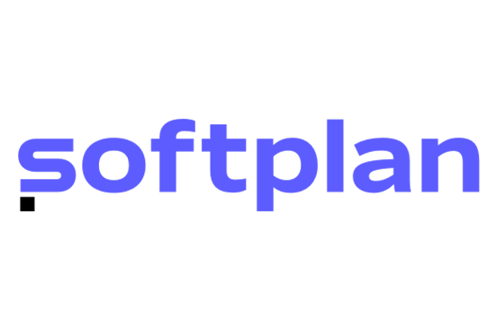

  

  
  

<h1 align="center">Find your employees!</h1>

## Summary

- [Summary](#summary)
- [Sobre o projeto](#sobre-o-projeto)
- [Getting started](#getting-started)

## Sobre o projeto

  Desenvolvimento de aplicativo com foco terapêutico, que através da reprodução de áudio objetivam o tratamento de emoções traumáticas, possibilitando o usuário escolher as playlists de acordo com a emoção desejada (ansiedade, autoestima, motivação, etc).

## Getting started

1. Clone este repositório
2. Instale as dependências gerais com `yarn install`

Este projeto reforça mensagem de commits com o padrão semântico.
